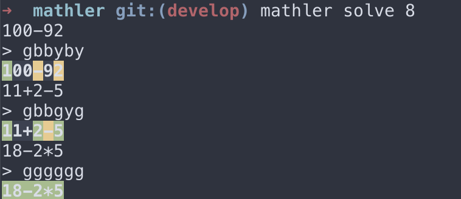

# mathler

terminal version of https://www.mathler.com/, also a solver for mathler game.

### Usage

```shell
# start a new game, optional-puzzle is a puzzle answer string, e.g. '18-2*5'
mathler play <optional-puzzle>
# interactive solving a mathler puzzle with the given target
mathler solve <target>
```




### Develop

Install git hooks

```
ln -sf $(pwd)/.hooks/pre-commit $(pwd)/.git/hooks/pre-commit
```

### explain

You have 6 guesses to find the hidden calculation.

Every guess must equal to the target number.

After each guess the color of the tiles will change to show how close you were.

- green is in the solution and in the correct spot.
- yellow is in the solution but in the wrong spot.
- gray is not in the solution.

Notes

- Number and operators can appear more than once.
- Calculations follow order of operations (PEDMAS).
- No leading 0s allowed.
- Commutative operations are not accepeted as correct.
